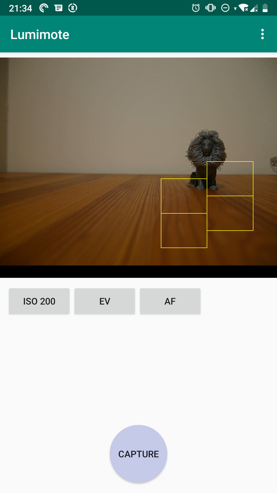

# Lumimote

An Android application in alpha stages for remote control of Panasonic Lumix cameras. Since it is based on an unofficial reverse engineered API it is likely that other cameras than the LUMIX GM1 will need modifications for all features to work.



## Currently supported features
* Live viewfinder preview
* Remote shutter
* Touch to focus (some focus points will even be shown in the app viewfinder)
* Some settings such as ISO can be changed and monitored

## Notes
Disable mobile data before starting the app or it will be unable to find the camera.

## Protocol information
There is some information on the MJPEG live stream (which also includes current settings and status information) available here: https://gist.github.com/FWeinb/2d51fe63d0f9f5fc4d32d8a420b2c18d
Some of what is described as additional header data there are the focus points. Each rectangle is represented like this (when read as ints):

```
0,    0,    topLeftX,   topLeftU,   bottomRightX,    bottomRightY,   65535
```

Where the coordinates are in thousands of the full screen ( `(500,500)` is the point in the middle of the screen). The purpose of `0,0` and `65535` is unknown.
See code for more information.

Normal operations are done using a reasonably simple HTTP api which returns plaintext or XML answers, see `LumixCommands.kt` for a list of the currently used ones. https://github.com/peci1/lumix-link-desktop/blob/master/requests.html has some more.
